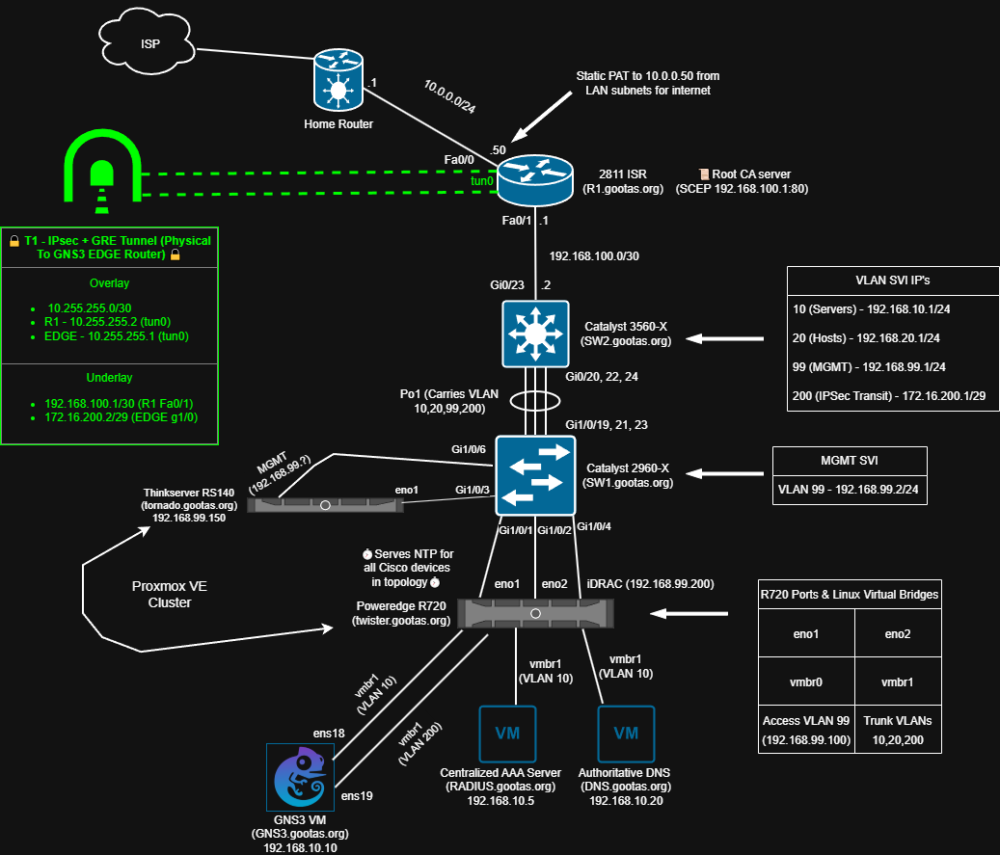
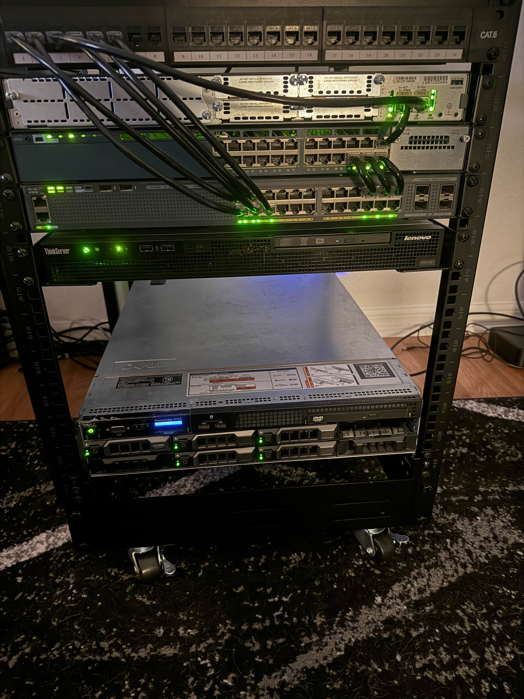

# Hybrid Network Security Homelab

This repo documents my **hybrid network-security homelab**: a physical Cisco + Proxmox rack that is tightly integrated with a virtual GNS3 site via an **IPsec + GRE (T1) site-to-site tunnel**. I use this environment to practice routing, VPNs, firewalling, AAA/802.1X, PKI, protocol-level security, and more as I continue to study.

---

## High-Level Topology

### Physical Core – On-Prem Rack

Real hardware layout:

**Highlights**

- Cisco **2811 ISR** as WAN edge, performing static PAT to the home LAN.
- Cisco **Catalyst 3560X** (L3) and **2960X** (L2) switches providing VLANs:
  - VLAN 10 – Servers  
  - VLAN 20 – Hosts  
  - VLAN 99 – Management / NTP  
  - VLAN 200 – IPsec / GRE transit segment (toward GNS3 Edge)
- Dell **PowerEdge R720** and Lenovo **RS140** running **Proxmox VE**.
- Core services:
    - **NTP** served exclusively from the **R720 Proxmox host** on **VLAN 99**  
    → used as the time source for all **Cisco routers/switches/ASA**; most lab VMs rely on their own Chrony configuration.
  - **AAA / RADIUS** (for device + 802.1X auth) on VLAN 10.
  - **Authoritative DNS** for `*.gootas.org` on VLAN 10.
- The **GNS3 VM** runs on the R720 and forms the bridge between the physical rack and the virtual GNS3 site.

---

### Virtual Site – Inside GNS3

**Highlights**

- **T1 – IPsec + GRE tunnel** between:
  - Physical **2811 ISR (R1)** and  
  - **GNS3 Edge router**
- Tunnel design:
  - **Overlay:** `10.255.255.0/30`  
    - R1 `tun0` – `10.255.255.2`  
    - EDGE `tun0` – `10.255.255.1`
  - **Underlay:** not bound to a single VLAN  
    - R1 side: `192.168.100.1/30` on the LAN-facing link  
    - EDGE side: `172.16.200.2/29` on **VLAN 200** inside the GNS3 site
- **EIGRP AS 1** runs **only between**:
  - The **ASAv outside interface** and  
  - The **inside-facing interface** of the GNS3 Edge router  
  (not across the VLAN 200 underlay itself).
- **OSPF Area 0** core with MD5 authentication:
  - Internal routers and the SNMPv3 NMS segment all participate in OSPF with MD5 auth on area-0 links.
- **Cisco ASAv firewall** providing:
  - Inside / DMZ segmentation  
  - ASDM access integrated with central RADIUS/AAA
- **SNMPv3 NMS** Docker container:
  - Deployed primarily to validate **SNMPv3 security (auth/priv)** and walk devices,  
    not as a full monitoring stack.

---

## PKI, AAA, and 802.1X / IPsec Integration

A key focus of this lab is integrating **PKI**, **AAA**, and multiple access methods:

- **Root CA on the 2811 ISR**
  - Acts as the root certification authority for the lab.
  - Exposes a **SCEP enrollment endpoint**, allowing devices (ASA, routers, etc.) to obtain certificates automatically.
- **802.1X with PEAP + MSCHAPv2**
  - Switchports authenticate clients via **PEAP + MSCHAPv2** against the central RADIUS server.
  - The **PEAP outer TLS tunnel** is terminated using a certificate issued by the **2811’s root CA**, enrolled via SCEP.
- **IPsec authentication**
  - The IPsec + GRE tunnel (T1) between R1 and the GNS3 Edge uses certificates from the same root CA, tying together:
    - RADIUS / 802.1X  
    - Web management (ASDM, device HTTPS)  
    - IPsec authentication

---

## What I’m Practicing Here

- Hybrid **physical + virtual** topology design (Cisco + Proxmox + GNS3).
- **IPsec + GRE** site-to-site tunneling with asymmetric underlay subnets.
- Routing:
  - OSPF Area 0 with **MD5 authentication**
  - Targeted **EIGRP** peering between ASA and GNS3 Edge
- Firewalling and DMZ design with **Cisco ASA / ASAv**:
  - NAT / PAT, security levels, ACLs, ASDM
- **Centralized AAA / RADIUS**:
  - Network device login
  - **802.1X PEAP + MSCHAPv2** for port access
- **PKI & SCEP**:
  - 2811 as root CA + SCEP server
  - Cert-based IPsec, HTTPS, and 802.1X server certs.
- **Secure management protocols**:
  - NTP over a dedicated management VLAN from a single trusted source
  - SNMPv3 lab (auth/priv) to validate configuration and behavior.
- **Packet capture & protocol validation with Wireshark**:
  - Capturing on physical and virtual links to inspect IPsec ESP/GRE encapsulation, OSPF MD5, EIGRP, 802.1X (PEAP/EAP + RADIUS), SNMPv3 flows, etc to confirm everything is behaving as designed.

---

## Repository Structure

- `docs/`
  - `topology-physical.png` – Physical homelab + Proxmox topology
  - `topology-gns3.png` – Virtual GNS3 site topology
- `configs/` 
  - Sanitized IOS / ASA / Linux config snippets for key components
- `notes/`
  - Design decisions, usage, and implementation documentation for various components

---

## Future Work

- Add sanitized router/switch/ASA configs (with sample IPsec, OSPF MD5, and 802.1X snippets).
- Document the **T1 IPsec + GRE** setup step-by-step.
- Add lab “scenarios” (e.g., break/fix).
- Expand SNMPv3 use into real monitoring or alerting.
- Continue to learn and implement more network security concepts.

---

## About Me

Homelab built and maintained while studying and working towards advanced network/security certifications (CCNP Security currently).  
For more about my background: **\[www.linkedin.com/in/dillon-alfieri-network\]**.
