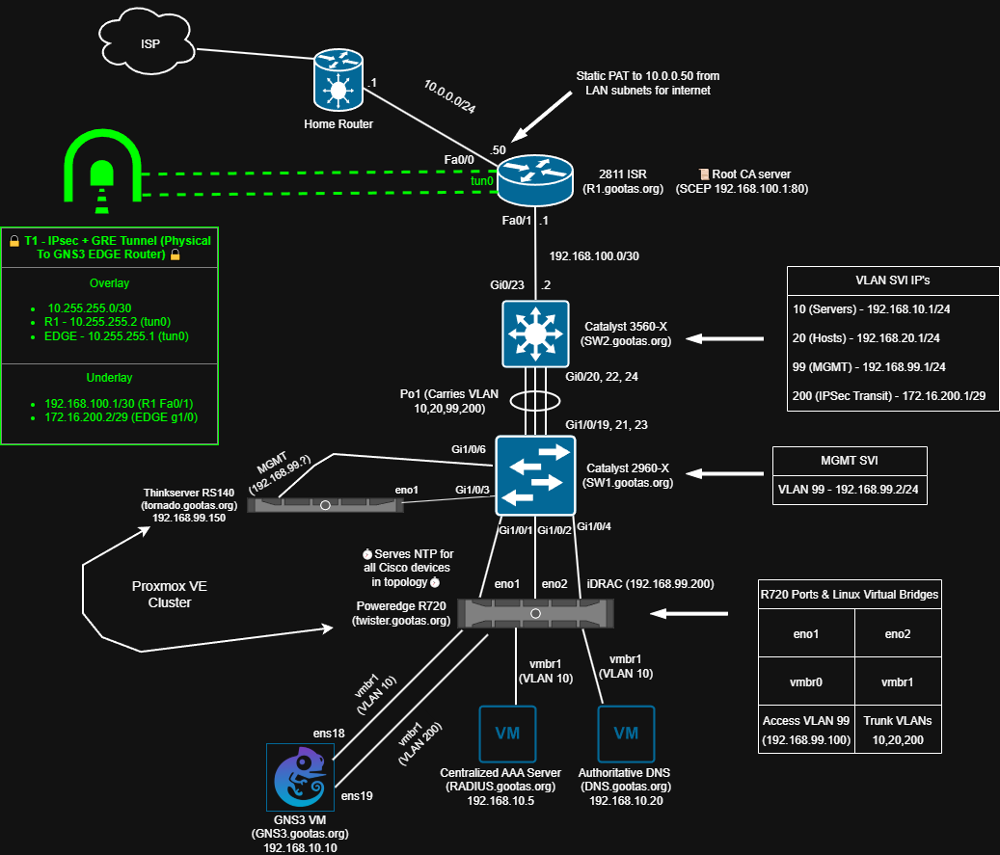
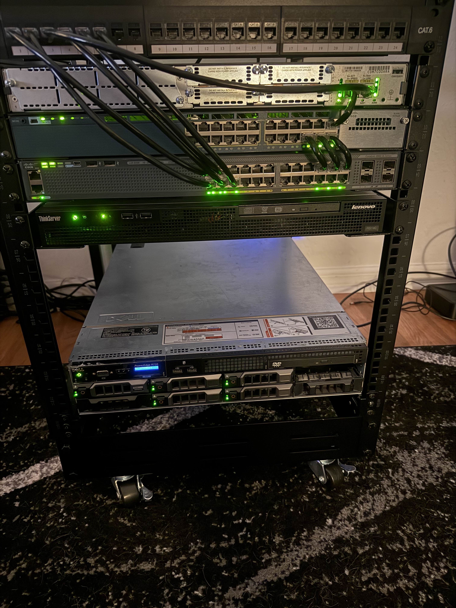

# Hybrid Cisco Networking Homelab

A hybrid Cisco networking homelab: a physical Cisco + Proxmox rack, plus a GNS3 environment hosted on the Proxmox host where I build enterprise routing and switching scenarios. I use it to build hands-on depth in enterprise routing, switching, network services, and protocol validation.

> **Status:** Originally built while studying CCNP Security; now focused on **CCNP Enterprise (ENCOR)**. The physical core is stable infrastructure; the GNS3 side has been reset to a clean slate and is being built out for enterprise labbing, tracked in [`scenarios/`](scenarios/).

---

## Physical Core (On-Prem Rack)



The stable foundation of the lab, and where most of the switching work lives.

- **Cisco 2811 ISR** — WAN edge; static PAT to the home LAN.
- **Cisco Catalyst 3560X (L3)** — core switch and default gateway: inter-VLAN routing via SVIs, per-VLAN DHCP, Rapid-PVST with root-priority tuning, and an LACP EtherChannel to the access switch.
- **Cisco Catalyst 2960X (L2)** — access switch: 802.1X-enabled ports, Rapid-PVST, LACP uplink to the core.
- **Dell PowerEdge R720 + Lenovo RS140** — Proxmox VE hosts. The R720 also runs the GNS3 VM and serves as the lab's single NTP source on the management VLAN.

**VLANs:** 10 (Servers) · 20 (Hosts / Endpoints) · 99 (Management / NTP)

**Core services:** centralized AAA/RADIUS (device login + 802.1X), authoritative DNS, and NTP from a single trusted host on VLAN 99.

Addressing detail: [`notes/ip-plan.md`](notes/ip-plan.md)

<details>
<summary>Rack photo</summary>



</details>

## GNS3 Environment

A virtual lab hosted on the Proxmox host (R720), **reset to a clean slate** and being built out for CCNP Enterprise topics — advanced routing, switching, and automation. Progress is documented as scenarios rather than a fixed topology, so the section grows as I work.

See [`scenarios/`](scenarios/).

## What I'm Practicing

**Routing & Switching (primary focus)**
- L3 switching: inter-VLAN routing, SVIs, per-VLAN DHCP
- Spanning Tree (Rapid-PVST) with root/priority tuning
- EtherChannel (LACP)
- OSPF and EIGRP, static routing — moving into BGP and redistribution

**Network Services & Assurance**
- NTP from a single trusted source over a dedicated management VLAN
- SNMPv3 (auth/priv) validation
- Packet capture and protocol validation with Wireshark

## Repository Structure

```
docs/        Topology diagram and rack photo
scenarios/   GNS3 lab log — one concept each: goal, config, what broke, takeaways
notes/       Design decisions and the IP plan
```

## Roadmap (CCNP Enterprise)

- Build out the GNS3 lab: OSPF areas, EIGRP, **BGP**, redistribution, and path control
- Grow the [scenarios](scenarios/) library (build + break/fix), one concept per writeup
- Network assurance: syslog, NetFlow, IP SLA, SPAN
- Automation: Python + NETCONF/RESTCONF and Ansible against lab devices

## About Me

Hybrid homelab built and maintained while studying toward advanced Cisco certifications (**CCNP Enterprise** — currently working through ENCOR). More about my background: [linkedin.com/in/dillon-alfieri-network](https://www.linkedin.com/in/dillon-alfieri-network)
